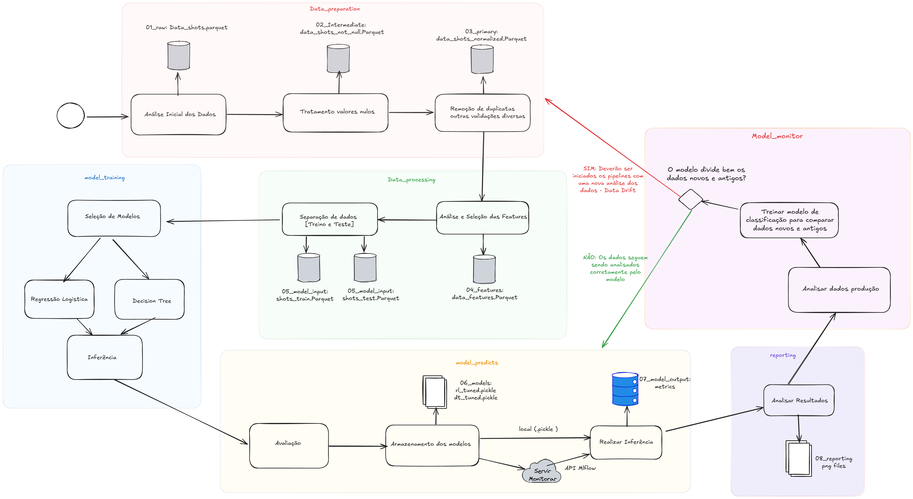

# Projeto de Previsão de Arremessos do Kobe Bryant

## Visão Geral

Este projeto foi desenvolvido como parte do **Curso de Especialização em Inteligência Artificial (INFNET)** e tem como objetivo prever se um arremesso do Kobe Bryant foi convertido ou não com base em dados históricos de jogos da NBA. Utilizando técnicas de machine learning, o projeto emprega o framework **Kedro** para gerenciamento de pipelines de dados, o **PyCaret** para treinamento e ajuste de modelos, e o **MLflow** para rastreamento de experimentos e implantação de modelos. O objetivo é construir um pipeline robusto que processe os dados, treine modelos, faça previsões e visualize os resultados de forma clara e informativa.

O conjunto de dados utilizado contém características como a localização do arremesso (`lat` e `lon`), tipo de arremesso (`shot_type`), tipo de ação (`action_type`), distância do arremesso (`shot_distance`), período do jogo (`period`) e a variável alvo `shot_made_flag` (1 para arremesso convertido, 0 para arremesso errado). O projeto abrange pré-processamento de dados, treinamento de modelos, previsão por meio de uma API e visualização das previsões em um gráfico de dispersão.

---

## Estrutura do Projeto

O projeto é organizado utilizando o framework **Kedro**, que garante um pipeline de dados modular e reprodutível. Abaixo está a estrutura do projeto:

```

pd-kobe/
├── conf/                           # Arquivos de configuração (configurações do Kedro, parâmetros, catálogo)
├── data/                           # Diretórios de dados (brutos, processados, saídas de modelo, etc.)
│   ├── 01_raw/                     # Conjunto de dados bruto
│   ├── 02_intermediate/            # Dados intermediários
│   ├── 03_primary/                 # Dados primários
│   ├── 04_feature/                 # Dados com engenharia de features
│   ├── 05_model_input/             # Dados prontos para o modelo
│   ├── 06_models/                  # Modelos treinados
│   ├── 07_model_output/            # Saídas do modelo (previsões)
│   ├── 08_reporting/               # Visualizações e relatórios (gráficos)
├── src/                            # Código-fonte do projeto
│   ├── pd_kobe/                    # Módulo principal do projeto
│   │   ├── pipelines/              # Pipelines do Kedro
│   │   │   ├── data_preparation/   # Pipeline de pré-processamento
│   │   │   ├── data_processing/    # Pipeline de seleção e engenharia de features
│   │   │   ├── model_training/     # Pipeline de treinamento de modelos
│   │   │   ├── model_predicts/     # Pipeline de resultados e previsões dos modelos treinados
│   │   │   ├── reporting/          # Pipeline de gráficos e métricas visuais
│   │   │   └── nodes.py            # Funções dos nós do pipeline
│   │   ├── settings.py             # Configurações do projeto
│   │   └── __init__.py             # Arquivo de inicialização
├── mlruns/                         # Diretório do MLflow para rastreamento de experimentos
├── predict.py                      # Script para previsões manuais (opcional)
├── requirements.txt                # Dependências do projeto
└── README.md                       # Documentação do projeto

```
--- 

## Funcionalidades Principais

1. **Pré-processamento de Dados**:
   - Foram fornecidas bases de dados de produção e desenvolvimento para treinamento e validação do modelo.
   - Aplicamos algumas regras e validações como tratamento de nulos e remoção de duplicatas

2. **Treinamento de Modelos**:
   - Dois modelos são treinados: Regressão Logística (`logistic_regression_model`) e Árvore de Decisão (`decision_tree_model`).
   - O PyCaret é usado para configurar o ambiente de treinamento, criar os modelos e ajustá-los com busca bayesiana de hiperparâmetros (usando a biblioteca `scikit-optimize`).
   - O MLflow rastreia os experimentos, logando métricas e os modelos treinados.

3. **Previsão via API**:
   - Os modelos treinados podem ser servidos via MLFlow ( ver mais na sessão 'Como executar o projeto')
   - Um nó do pipeline (`serve_and_predict`) faz a requisição à API (`/invocations`)
   - As previsões são salvas em `data/07_model_output/predictions.csv`.

4. **Visualização**:
   - Um gráfico de dispersão é gerado para visualizar os locais dos arremessos (`lat` e `lon`) e as previsões do modelo.
   - Arremessos previstos como convertidos (`1`) são representados por **bolinhas verdes**, e arremessos previstos como errados (`0`) por **bolinhas vermelhas**.
   - O gráfico é salvo em `data/08_reporting/shot_predictions.png`.

4. **Dashboard e Inferência**:
   - Foi criada uma dashboard com uma página para realizar inferências aos modelos e também uma para análise comparativa dos modelos 
   - Framework utilizado para a construção das páginas foi o Stremlit
   - O gráfico é salvo em `data/08_reporting/shot_predictions.png`.   

---

## Pré-requisitos

Para executar o projeto, você precisa ter as seguintes ferramentas instaladas:

- **Python 3.11**
- **Conda** (para gerenciamento de ambientes)
- **Kedro 0.19.12**
- **MLflow**
- **PyCaret**
- **Pandas**
- **Matplotlib** (para visualizações)
- **Seaborn** (opcional, para gráficos estilizados)
- **Scikit-learn**
- **Scikit-optimize** (para ajuste de hiperparâmetros)
- **Stremlit**  ( para a construção das páginas )

Você pode instalar as dependências listadas no arquivo `requirements.txt`:

pip install -r requirements.txt

## Como executar o projeto

1. **Configurar o ambiente**
    - Crie e ative um ambiente Conda para o projeto:
        conda create -n kedro_env python=3.11
        conda activate kedro_env
        pip install -r requirements.txt

2. **Configurar o MLflow**
    - Defina o URI de rastreamento do MLflow (já configurado no projeto):
        existe um parametro em conf/base/parameters.yml chamado 'path_mlflow_runs' coloque a pasta onde ficará o projeto no seu ambiente e adicione /mlruns ao final.

3. **Executar o Pipeline**
    - kedro run

    Isso irá:
    1. Pré-processar os dados e selecionar as features.
    2. Treinar os modelos (Regressão Logística e Árvore de Decisão).
    3. Fazer previsões dos modelos localmente
    4. Gerar o gráfico de dispersão, curva, roc, métricas e mais.
    5. Disponibilizar a estrutura para iniciar a dashboard e a inferência

4. **Para criar a API com os modelos e consumi-la**
   1. **Modelo árvore de decisão**
      - Executar o comando:  *mlflow models serve -m "models:/decision_tree_model/latest" -p 5001 --env-manager conda*
      - Isso irá subir o modelo de árvore de decisão para inferência
      - Rodar o pipeline de inferência da DT : *kedro run --pipeline predict_api_decision_tree*
      - Serão criados os artefatos referentes a análise da árvore de decisão ( Mais detalhes na sessão artefatos )

   2. **Modelo Regressão Logistica**
      - Executar o comando:  *mlflow models serve -m "models:/logistic_regression_model/latest" -p 5002 --env-manager conda*
      - (*Atenção ao número da porta, caso seja necessário, pode alterar o parâmetro do pipeline*)
      - Isso irá subir o modelo de Regressão Logística para inferência
      - Rodar o pipeline de inferência da LR : *kedro run --pipeline predict_api_logistic_regression*
      - Serão criados os artefatos referentes a análise da árvore de decisão ( Mais detalhes na sessão artefatos )   

5. **Para executar a Dashboard do stremlit**
   - Acesse o diretório do streamlit no projeto pelo terminal (cd streamlit)
   - Execute o comando *python -m streamlit run Home.py*
   - Isso irá exibir a página principal 


## Diagrama de Pipelines e Fluxos




## Detalhes dos Pipelines

 ### 1. Preparação dos Dados (data_preparation) ###
O pipeline data_preparation é responsável pela limpeza inicial dos dados brutos, garantindo que estejam prontos para as próximas etapas do projeto. Ele processa tanto o conjunto de dados principal (data_shots) quanto o conjunto de produção (data_shots_prod). As principais etapas incluem:

- Tratamento de Valores Nulos (handle_missing_values): Remove todas as linhas que contêm valores nulos no conjunto de dados, garantindo que o modelo receba apenas dados completos.

- Remoção de Duplicatas e Validações (remove_duplicates_and_validate): Elimina registros duplicados, mantendo apenas a última ocorrência, e realiza validações adicionais para assegurar a integridade dos dados.


 ### 2. Processamento dos Dados e Seleção de Features (data_processing) ### 
O pipeline data_processing realiza o processamento e a seleção de features, preparando os dados para o treinamento do modelo. Ele também divide o conjunto de dados em treino e teste. As etapas incluem:


- **Análise e Seleção de Features (analyze_and_select_features)**: Seleciona um subconjunto de features relevantes para o modelo, incluindo lat, lon, minutes_remaining, period, playoffs, shot_distance, loc_x, loc_y e shot_made_flag. Essa etapa é aplicada tanto ao conjunto de dados principal (data_shots_normalized) quanto ao conjunto de produção (data_shots_prod_normalized), gerando os datasets data_features e data_features_prod, respectivamente.

- **Divisão dos Dados (split_data)**: Divide o conjunto de dados data_features em conjuntos de treino (shots_train) e teste (shots_test) na proporção 80/20, utilizando estratificação com base na variável alvo shot_made_flag para manter a proporção de classes. A divisão é feita com um random_state=42 para garantir reprodutibilidade.


- **split_data_node**: Divide o conjunto de dados principal em treino e teste.

 ### 3. Treinamento de Modelos (model_training) ###
O pipeline model_training é responsável pelo treinamento e ajuste de dois modelos de machine learning: uma Regressão Logística e uma Árvore de Decisão. Ele utiliza o PyCaret para configurar o ambiente de treinamento e o MLflow para rastrear os experimentos. As etapas incluem:

- **Configuração do PyCaret (configure_pycaret_setup)**: Configura o ambiente de treinamento do PyCaret, definindo a variável alvo (shot_made_flag), utilizando todos os núcleos disponíveis (n_jobs=-1) e habilitando o uso de GPU (use_gpu=True).
- **Treinamento da Regressão Logística (logistic_regression_model)**: Treina um modelo de Regressão Logística com ajuste de hiperparâmetros usando busca bayesiana (via scikit-optimize). O espaço de busca inclui parâmetros como penalty, C, class_weight, max_iter, tol e solver. O modelo é otimizado com base no F1 Score, e os resultados (métricas e modelo) são logados no MLflow.
- **Treinamento da Árvore de Decisão (decision_tree_model)**: Treina um modelo de Árvore de Decisão com ajuste de hiperparâmetros, também usando busca bayesiana. O espaço de busca inclui parâmetros como criterion, splitter, max_depth, min_samples_split, min_samples_leaf, max_features, ccp_alpha e max_leaf_nodes. O modelo é otimizado com base no F1 Score, e os resultados são logados no MLflow.
O pipeline contém dois nós:

- *logistic_regression_model*: Treina e ajusta a Regressão Logística, gerando o modelo lr_tuned.
- *decision_tree_model*: Treina e ajusta a Árvore de Decisão, gerando o modelo dt_tuned.

 ### 4. Previsões dos Modelos com Dados de Treino e Teste (model_predicts) ###
O pipeline model_predicts realiza previsões com os modelos treinados (Regressão Logística e Árvore de Decisão) nos conjuntos de treino (shots_train) e teste (shots_test), além de calcular métricas de desempenho. As etapas incluem:

- **Cálculo de Métricas e Previsões (calculate_model_metrics)**: Faz previsões com os modelos nos dados de treino e teste, calcula métricas de desempenho (acurácia, precisão, recall, F1 Score e ROC AUC) e retorna três datasets:
- Um DataFrame com as métricas (metrics).
- Um DataFrame com as previsões e os valores reais (predictions).
- Um DataFrame com as probabilidades previstas (predicted_probabilities).


 ### 5. Relatórios, Gráficos e Métricas (reporting) ###
O pipeline reporting é responsável por gerar relatórios visuais e gráficos para avaliar o desempenho dos modelos e visualizar os resultados das previsões. Ele também faz previsões no conjunto de produção (data_features_prod) via API do MLflow. As etapas incluem:

- **Geração de Relatórios Visuais (save_model_plots_metrics)**: Gera cinco tipos de visualizações para cada modelo (Regressão Logística e Árvore de Decisão) nos conjuntos de treino e teste:

- **Matriz de Confusão**: Mostra a distribuição de previsões corretas e incorretas.
- **Curva ROC**: Exibe a curva ROC e o valor de AUC para avaliar a capacidade de discriminação do modelo.
- **Tabela de Métricas**: Apresenta as métricas de desempenho (acurácia, precisão, recall, F1 Score, ROC AUC) em formato de tabela.
- **Distribuição de Probabilidades**: Plota um histograma das probabilidades previstas, mostrando a distribuição das previsões.
- **Gráfico de Chutes do Kobe**: Um gráfico de dispersão que mostra os locais dos arremessos (loc_x e loc_y), com bolinhas verdes para acertos e vermelhas para erros, com base nos valores reais (shot_made_flag).
Esses gráficos são salvos no diretório data/08_reporting/ com nomes que indicam o modelo e o conjunto de dados (ex.: confusion_matrix_report_LR_train.png).
- **Previsão via API (serve_and_predict)**: fFaz a requisição à API (/invocations) para prever os arremessos no conjunto de produção (data_features_prod) e retorna as previsões como um DataFrame (predictions).
- **Gráfico de Previsões (plot_shot_predictions)**: Gera um gráfico de dispersão com os locais dos arremessos no conjunto de produção (lat e lon), usando as previsões do modelo. Arremessos previstos como convertidos (1) são representados por bolinhas verdes, e arremessos previstos como errados (0) por bolinhas vermelhas. O gráfico é salvo em data/08_reporting/shot_predictions.png.


## Descrição dos artefatos gerados 
   - **01_raw/data_shots e dataset_kobe_prod** = Dados de arremessos não tratados fornecidos para o projeto. (formato parquet)

   - **02_intermediate/data_shots_not_null e data_shots_prod_not_null** = Dados de arremessos depois de ter tratados os valores nulos(formato parquet)

   - **03_primary/data_shots_normalized e data_shots_prod_normalized** = Dados dos arremessos com análise e remoção de duplicatas(formato parquet)
   
   - **04_feature/data_features_prod e data_features** = Dados gerados a partir da seleção das features (formato parquet)

   - **05_model_input/shots_test e shots_train** = Separação dos dados em treino e teste na proporção 80% e 20% estratificados prontos para o treinamento dos modelos (formato parquet)

   - **06_models/dt_tuned e lr_tuned** = Modelos treinados, ajustados(tuned) e salvos no formato .pickle 

   - **07_model_output/** = Métricas e previsões dos modelos (.csv)
      - Arquivos de métricas (metrics_*) contém as métricas dos modelos em diferentes cenários (Treino, Teste e Prod)
      - Arquivos de probabilidades (predicted_probabilities_*) também com diferentes cenários (Treino, Teste e Prod), 
      - arquivos de predições (predictions_*) Arquivos das predições dos modelos nos diferentes cenários (Treino, Teste e Prod)

   - **08_reporting** = Plots e análises gerais dos dados e modelos (.png )
      - confusion_matrix_* = Análise da matriz de confusão nos diferentes cenários (Treino, Teste e Prod)
      - distribuitions_* = Análise das distribuições de probabilidades (treino e teste)
      - kobe_shots_* = Análise da distribuição dos arremesos do Kobe dentro da quadra ( Treino e Teste )
      - metrics_report_* = Métricas dos modelos em forma visual (Treino, teste e Prod)
      - roc_curve_* = Análise da curva ROC dos modelos nos diversos cenários (Treino, Teste e Prod)
      - Shot_predictions_* = Análise das previsões com dados de produção para os modelos RL e DT
      - feature_importance_* = Análise da importância das features que o modelo considerou nos diversos cenários (Treino, teste e Prod)


## Resultados

**Seleção do modelo para conclusão:**
   Nesta análise observamos que a Decision Tree obteve resultados melhores com os dados de produção, conseguindo prever dados de arremesos em produção. Por sua vez a regressão logistica apresentou melhores resultados com os dados de Treino e Teste, mas perfomando muito mal em produção, o que era esperado, já que a base de dados de produção contém apenas amostras que não foram contempladas no treinamento do modelo.
   Ambos os modelos não tinham capacidade de perfomar bem para o dataset de produção pois os dados não estavam contidos na amostra de treinamento.
   Analisando as métricas e os graficos, com os dados de Teste e não de produção, o modelo candidato para mais experimentos e tunings seria a **Regressão logistica**. 

**Modelos Treinados**: Os modelos e todas as suas métricas são salvos no MLflow e podem ser acessados via UI (mlflow ui) em http://localhost:5000. Executando antes o comando mlflow server

**Previsões**: As previsões são binárias (0 para erro, 1 para acerto) e salvas em um arquivo CSV. Também são salvos diversos plots e gráficos para análise do caso.

**Gráfico de Dispersão**: O gráfico mostra os locais dos arremessos com bolinhas verdes (acertos) e vermelhas (erros), facilitando a análise visual das previsões.

## Ferramentas ##

### MLFlow ### 
   O MLFlow é uma plataforma para o gerenciamento do ciclo de vida de um projeto de Machine Learning. Ele ajuda no rastreio de experimentos, análise de modelos, comparação de métricas e estrutura de pipelines. O MLFlow é uma plataforma vasta e tem muitos outros recursos que podem ser explorados em outros projetos.
   #### Para que o MLFlow foi usado no projeto? ####
   - **Rastreamento de experimentos**: O processo de Análise de hyperparametros, métricas, comparações de modelos pode ser bem desafiador se não houver um gerenciamento dos resultados. O MLFlow foi utilizado exatamente para isso. Com ele, conseguimos rastrear o experimento, os hyperparametros dos modelos, as métricas e resultados de diversas rodadas de testes e treinamentos. Com o MLFlow Ui nós podemos comparar as versões dos modelos que obtiveram melhores resultados e promove-los para serem candidatos a um processo de produção. 
   - **Atualização do modelo**: Através do MLFlow e do registro dos experimentos, podemos Promover o melhor modelo, que obteve os melhores resultados para ser um candidato a produção.
   - **Provisionamento (Deployment)** Através dos comandos para servir o modelo, conforme mostrado anteriormente, temos a opção de escolher o 'Production' ao invés do 'Latest' para servir o modelo promovido a produção.

### Pycaret ### 
   O Pycaret é uma biblioteca Python para automação de Machine Learning (AutoML). Ele simplifica e acelera o desenvolvimento de modelos de ML permitindo que seja possível a comparação e experimentos de diferentes algoritmos e pipelines com poucas linhas de código. O Pycaret é uma biblioteca completa e muito eficiente.
   #### Para que o Pycaret foi usado no projeto? ####
   - **Seleção de modelos**: Embora tenhamos escolhido de maneira fixa os modelos de Árvore de decisão e Regressão Logistica, utilizamos o Pycaret, ainda assim, para nos fornecer esses modelos.
   - **Tuning e funções de trinamento**: Utilizamos o Pycaret também na etapa de criação do experimento e no Tuning dos modelos, ajustes de hyperparametros e tipos de buscas

### Streamlit ### 
   O Streamlit é um framework python para criar aplicativos web interativos de maneira extremamente simples e rápida, sem que seja necessário muito conhecimento em desenvolvimento web. Ele é muito utilizado na etapa de Inferência de dados, apresentação de resultados e para transformar notebooks Jupyter e scripts Python em dashboards interativos.
   #### Para que o Pycaret foi usado no projeto? ####
   - **Comparação de Modelos e monitoramento da saúde do modelo**: Foi criada uma página que comparou as métricas dos dois modelos com os dados de produção.
   - **Inferência dos dados**: Foi criada uma página para inputar os dados para fazer uma análise se o Kobe acertou ou errou o arremesso.

### Scikit-Learn ###
   O Scikit-Learn é uma das bibliotecas mais populares para Machine Learning em Python. Ele possui uma ampla variedade de ferramentas de aprendizado de máquina, incluindo classificação, regressão, clustering e redução de dimensionalidade. Ele possui também funções para pré-processamento de dados, como Seleção de modelos e otimização de hiperparâmetros.
   #### Para que o Scikit-Learn foi usado no projeto? ####
   **Separação de Treino e Teste**: Foi utilizada a função *train_test_split* para criar as amostras de Treino e Teste de maneira estratificada na etapa de processamento dos dados.
   **Métricas**: Foram utilizadas diversas ferramentas de Métricas do Scikit-learn para avaliar os modelos, como acurácia, precisão, recall, f1, logloss etc.
   **Gráficos**: O Scikit-learn também entrou no pipeline de Reporting para gerar os conteúdos que seriam plotados, como Matriz de Confusão, Curva roc e Auc_score
   **Seleção do modelo**: a Integração do MLFLow e Scikit-learn foi utilizada no registro das métricas dos modelos.

## Problemas no Projeto

Os dados fornecidos para treinamento do modelo continham apenas shots realizados de dentro do garrafão, ou seja, shots de 2 pontos. A base de produção foi fornecida apenas com shots realizados de fora do garrafão. Por conta disso, tivemos um modelo que não foi capaz de prever os acertos de produção, classificando tudo como erro, no caso da regressão logistica e chutando aleatóriamente, no caso da árvore de decisão. A Árvore de decisão ainda conseguiu prever alguns acertos, mas é perceptível que não passou de aleatoriedade. Já a regressão logística, não foi capaz de prever nenhum arremesso como positivo.
 
 
## Possíveis Melhorias

**Balanceamento de Classes**: Precisariamos de mais dados de fora do garrafão no treinamento do modelo para melhorar as métricas e conseguir prever outros tipos de arremessos também.

**Mais Features**: Verificar outras features como a area do shot, season para verificar uma possivel sazonalidade o team_name apesar de não parecer, pode favorecer em diversas jogadas que o levariam a acertar mais arremesos, o oponente poderia indicar algo sobre a marcação que ele teria etc. Pode ser feita uma análise mais profunda das features e encontrar relações com a taxa de acerto dos arremessos.

**Modelos Mais Complexos**: Testar modelos mais avançados, como Random Forest ou Gradient Boosting, pode capturar melhor os padrões nos dados.

**Obter Probabilidades**: Atualmente, a API do MLflow retorna apenas previsões binárias. Uma melhoria seria ajustar o modelo servido para retornar as probabilidades (predict_proba) e usá-las para colorir o gráfico com um gradiente.

### Sinta-se à vontade para usar, modificar e distribuir o código conforme necessário. ###